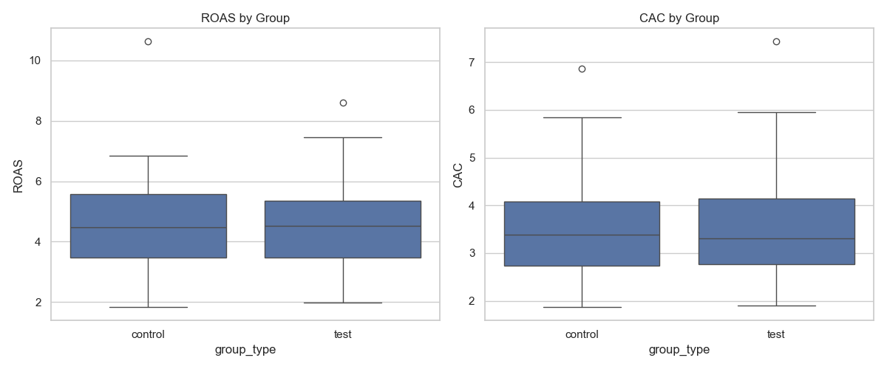
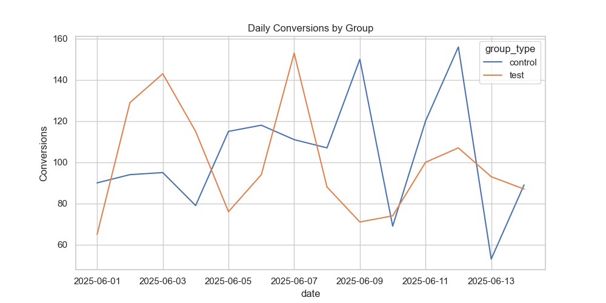
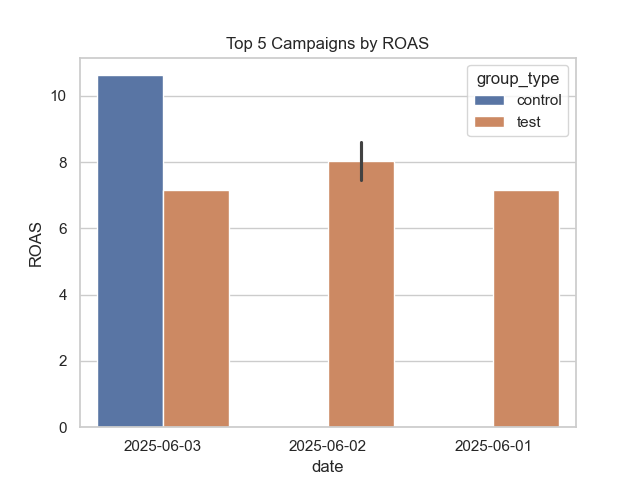

# Ad Bidding A/B Test Analysis

A case study comparing manual and automated ad-bidding strategies across four performance-marketing KPIs: click-through rate, conversion rate, return on ad spend and customer acquisition cost.

> The dataset is simulated. The project demonstrates analytical workflow and decision-making rather than a production experiment.

## Business question

Should a marketing team favor manual or automated bidding, and what trade-offs should it consider when choosing between control, consistency and scale?

## Approach

1. Generated and prepared campaign-level data.
2. Aggregated campaign KPIs in SQL.
3. Compared group distributions and daily performance in Python.
4. Reviewed top-performing campaigns and variability between strategies.
5. Translated the results into an operating recommendation.

## KPI definitions

| KPI | Calculation |
|---|---|
| CTR | Clicks ÷ impressions |
| CVR | Conversions ÷ clicks |
| ROAS | Revenue ÷ advertising spend |
| CAC | Advertising spend ÷ conversions |

## Findings

- CTR and CVR were similar across the two groups.
- Manual bidding produced slightly better average ROAS and lower CAC.
- Automated bidding showed greater variability and occasional early performance spikes.
- Most of the top campaigns by ROAS were in the manual group.

The observed differences should be treated as directional. A production decision would require a pre-defined hypothesis, power analysis, confidence intervals and significance testing.

## Recommendation

Use manual bidding when consistency and direct control are priorities. Automated bidding may be useful for rapid scaling and exploration, provided performance thresholds are monitored. A practical next test would use automation for discovery and apply manual optimization to campaigns that cross an agreed performance threshold.

## Repository structure

```text
data/       Clean campaign dataset
notebooks/  Main analysis notebook
outputs/    Generated visualizations
scripts/    Data-generation script
sql/        KPI aggregation query
```

## Selected visualizations

### ROAS and CAC distributions



### Daily conversions



### Highest-ROAS campaigns



## Reproduce the analysis

```bash
git clone https://github.com/AtifElmasry/ad-bidding-ab-test-zalando-case-study.git
cd ad-bidding-ab-test-zalando-case-study
pip install -r requirements.txt
```

Open `notebooks/analysis.ipynb`, or review `sql/campaign_kpi_analysis.sql`.

## Tools

Python, pandas, Seaborn, SQL, MySQL and Jupyter Notebook

## Author

[Atif Elmasry](https://github.com/AtifElmasry) · [LinkedIn](https://www.linkedin.com/in/tioatifelmasry/)
